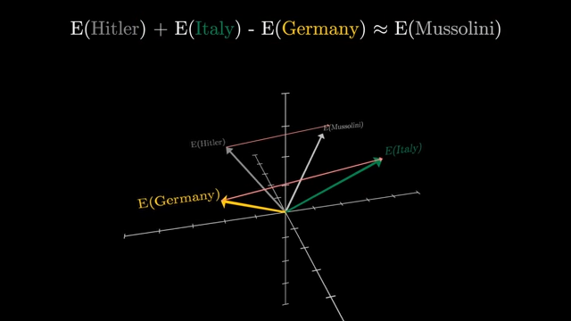
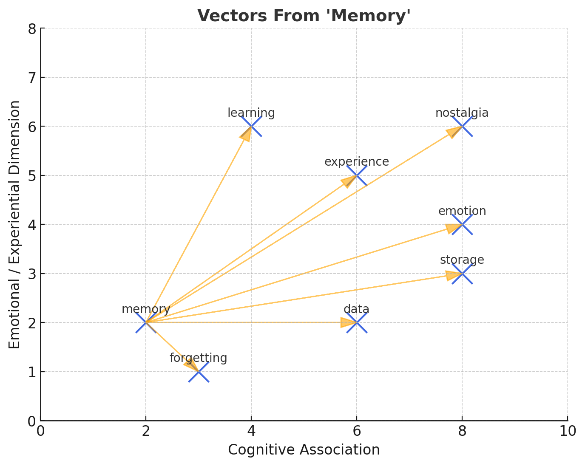

## Apa topiknya

**Diskusi 1 “Fungsi Bahasa, Ihwal Penerjemahan juga Masalah Penerjemahan”**

Pertama, diskusikanlah dua hal berikut ini. 

Fungsi bahasa adalah fungsi kognitif. Fungsi ini mencakup unsur-unsur bahasa maupun di luar bahasa dengan jaringan semantisnya. Yang dapat dijelaskan sebagai berikut. Perhatikan kata “memory” dalam pemakaiannya pada kalimat berikut. 

1. He had a long **memory** for people who had disappointed him.
2. In computing, memory is a device or system that is used to store information for immediate use in a computer or related computer hardware and digital electronic devices

Kedua, perhatikan  terjemahan teks sumber dalam bahasa Inggris ke dalam bahasa Indonesia berikut ini dan jelaskan jenis kesalahan penerjemahan yang terjadi pada teks berikut.

| **Teks Sumber**                                                                                                                                                                                                                                                                                                                                                                                                                                        | **Teks Sasaran**                                                                                                                                                                                                                                                                                                                                                                                                                                                                                          | **Jenis Kesalahan dan Penjelasan** |
| ------------------------------------------------------------------------------------------------------------------------------------------------------------------------------------------------------------------------------------------------------------------------------------------------------------------------------------------------------------------------------------------------------------------------------------------------------ | --------------------------------------------------------------------------------------------------------------------------------------------------------------------------------------------------------------------------------------------------------------------------------------------------------------------------------------------------------------------------------------------------------------------------------------------------------------------------------------------------------- | ---------------------------------- |
| **Anxiety in speaking English is a critical affective reaction to second language acquisition**. Moreover, language learning is an emotionally dynamic process which produces fluctuations in learners’ speaking anxiety. **Therefore, this case study was designed to investigate English as a foreign language (EFL) learners’ speaking anxiety from an ecological perspective based on nested ecosystems model and complex dynamic system theory**. | **Kecemasan dalam berbicara menggunakan bahasa Inggris adalah reaksi yang kritis terhadap penguasaan bahasa kedua**. Selain itu, pembelajaran bahasa adalah proses dinamis emosional yang menghasilkan fluktuasi kecemasan berbicara peserta didik. **Oleh karena itu, studi kasus ini dirancanguntuk menyelidiki kecemasan berbicara menggunakan bahasa Inggris sebagai bahasa kedua (EFL) pelajar dariperspektif ekologi berdasarkan model ekosistem bersarang dan dinamika kompleks teori sistem**. |                                    |

## Text Diskusimu?

Assalamualaikum Wr. Wb.
Hello everyone, selamat malam Bapak Dosen serta kawan2 semua. Malam ini, saya ingin membahas topik diskusi pada sesi 1 ini, matakuliah Teori dan Masalah Penerjemahan. Mari kita bahas bersama sama
## Nomor 1 :
Senada dengan topik di atas yang menjelaskan fungsi bahasa adalah fungsi kognitif. Saya ingin menambahkan pada course Dicoding AI Engineer belakangan ini [^1], saya menemukan ada sebuah teknologi yang bernama Vector Db[^3] yang digunakan AI (seperti ChatGPT, Gemini, Dll) untuk mengakses kata dan padanannya. Bisa kalian lihat dibawah ini.

Nahh didalam otak kita ini kurang lebih sama, suatu kata memantik jaringan semantik otak. Maka akan muncul berbagai asosiasi didalamnya. 

percobaan saya memuat vector dari kata memory.

Maka, Teknologi vector embedding (yang meniru cara otak mengorganisir makna) berhasil memodelkan hubungan semantik antar kata dengan cara yang sangat mirip proses kognitif manusia. Artinya, **konsep fungsi kognitif bahasa bukan cuma teori abstrak**, tapi juga terbukti secara komputasional lewat penerapan AI.

---
Kembali ke topik diskusi diatas, berikut adalah penjelasan contoh kata "memory":
- **Kalimat 1:** "He had a long memory for people who had disappointed him."
    - Di sini, "memory" berarti kemampuan seseorang untuk mengingat pengalaman atau orang di masa lalu (fungsi kognitif: memori dan emosi).
- **Kalimat 2 (komputasi):** "In computing, memory is a device or system that is used to store information for immediate use in a computer..."    
    - Pada konteks ini, "memory" merujuk pada perangkat fisik atau sistem dalam komputer yang menyimpan data (fungsi kognitif: penyimpanan dan pengolahan informasi, tapi maknanya lebih teknis).
**Kesimpulan:**  
Makna kata "memory" bisa berbeda tergantung konteksnya. Dalam bahasa, fungsi kognitif mencakup pemahaman makna kata, penggunaan dalam kalimat, dan penyesuaian makna sesuai situasi.

## Nomor 2 :
**Kesalahan Makna (Semantic Error):**
"Critical affective reaction" diterjemahkan menjadi "reaksi yang kritis", padahal seharusnya "reaksi afektif yang penting" atau "reaksi emosional yang signifikan". Kata "critical" di sini berarti "penting" atau "krusial", bukan "kritis" dalam arti negatif. [^2]

**Kesalahan Struktur (Syntactic Error):**
"English as a foreign language (EFL) learners’ speaking anxiety" diterjemahkan menjadi "kecemasan berbicara menggunakan bahasa Inggris sebagai bahasa kedua (EFL) pelajar", padahal "EFL" berarti "bahasa asing", bukan "bahasa kedua". Seharusnya: "kecemasan berbicara peserta didik EFL (bahasa Inggris sebagai bahasa asing)".[^4]

**Kesalahan Penempatan Frasa (Phrase Placement Error):**
"from an ecological perspective based on nested ecosystems model and complex dynamic system theory" diterjemahkan secara literal dan kurang jelas. Sebaiknya: "dari perspektif ekologi berdasarkan model ekosistem bersarang dan teori sistem dinamis kompleks".

**Penjelasan:**  
Kesalahan penerjemahan terjadi karena:
- Pemilihan kata yang kurang tepat ("kritis" vs "krusial/penting").
- Salah memahami istilah teknis ("EFL" sebagai "bahasa kedua" bukan "bahasa asing").
- Struktur kalimat yang terlalu literal sehingga makna asli tidak tersampaikan dengan baik.

Saya kira cukup pembahasan topik dari saya, semoga bermanfaat.

Danke Schoen😁

---

[^1]: [Prompt Engineering untuk Software Developer - Dicoding Indonesia](https://www.dicoding.com/academies/753-prompt-engineering-untuk-software-developer)

[^2]: Definition of _critical adjective_ from the Oxford Advanced Learner's Dictionary. Source https://www.oxfordlearnersdictionaries.com/definition/english/critical?q=critical#:~:text=serious/dangerous,in%20our%20country%27s

[^3]: Vector DB Explained on Transformers, the tech behind LLMs | Deep Learning Chapter 5. source: https://youtu.be/wjZofJX0v4M?t=945

[^4]: [EFL abbreviation - Definition, pictures, pronunciation and usage notes | Oxford Advanced Learner's Dictionary at OxfordLearnersDictionaries.com](https://www.oxfordlearnersdictionaries.com/definition/english/efl?q=EFL)
